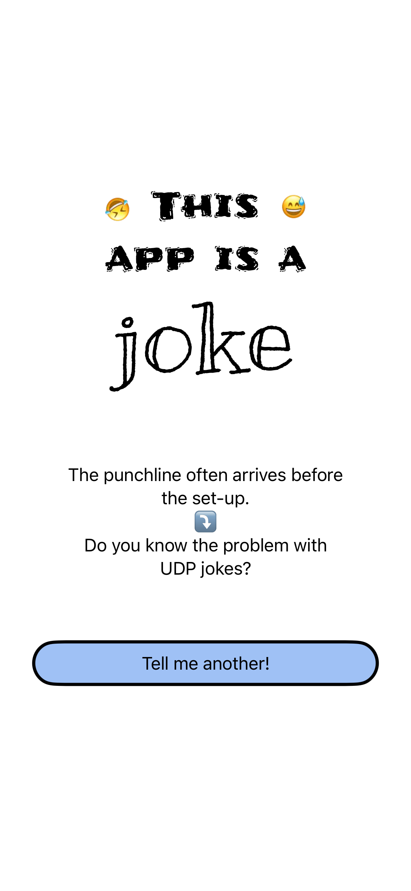
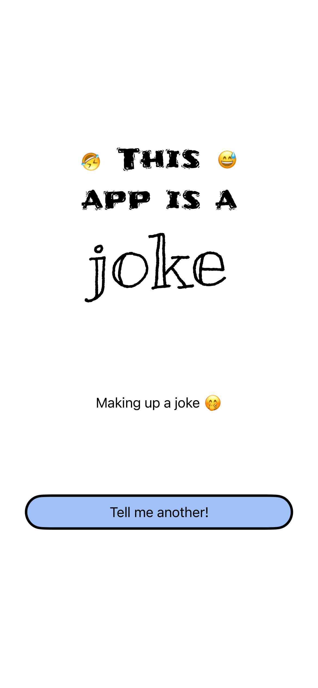
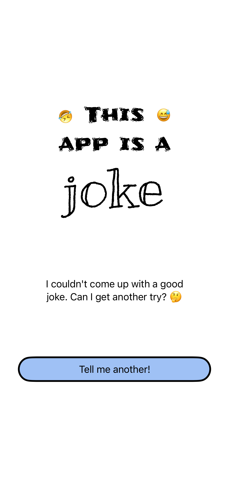

# Jokes app
The goal of this project is to showcase the way of testing the SwiftUI code.

Blos posts about testing SwiftUI code from series:
- [Testing SwiftUI Code - The beginning (UI)](https://www.mobiledevdiary.com/posts/testing-swiftui-code-the-beginning/)
- [TDD with SwiftUI - Triggering API request](https://www.mobiledevdiary.com/posts/testing-swiftui-code-in-tdd-button-action-request/)

The first blog post about testing UI code you can find on [Mobile Dev Diary](https://www.mobiledevdiary.com) blog.

## Screenshots
| joke | loading | failure |
| ---- | ------- |-------- |
|  |  |  |
