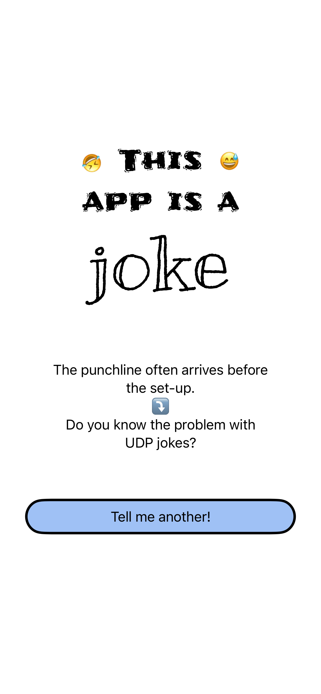
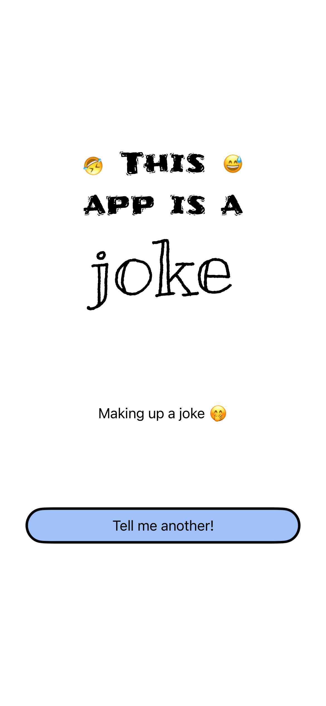
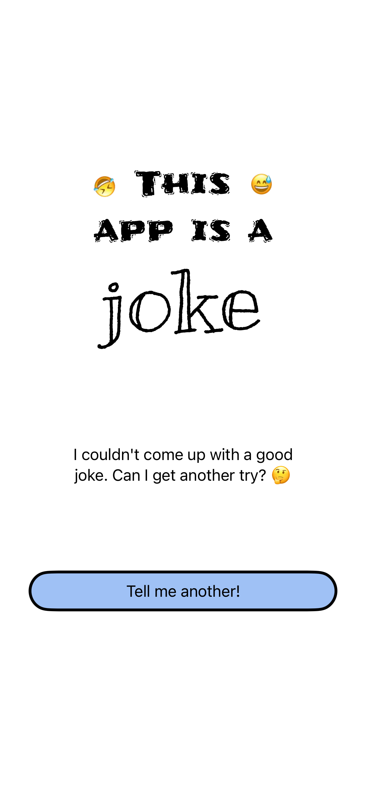

# Jokes app
The goal of this project is to showcase the way of testing the SwiftUI code.

The first blog post about testing UI code you can find on [Mobile Dev Diary](https://www.mobiledevdiary.com) blog.

## Screenshots
| joke | loading | failure |
| ---- | ------- |-------- |
|  |  |  |
